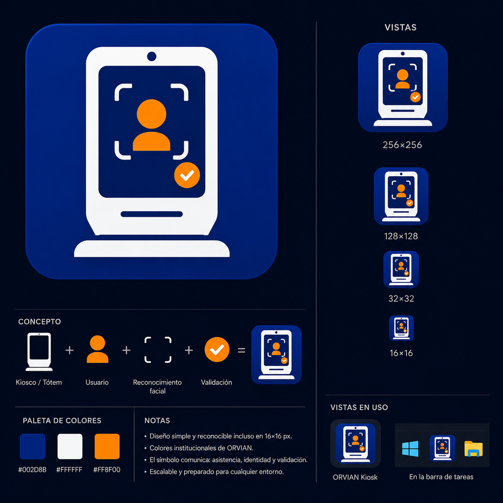

# Diseño de ORVIAN Kiosk

Recursos de diseño utilizados durante el desarrollo de la identidad visual de **ORVIAN Kiosk**.



---

## Contenido

```
design/
├── README.md
├── description.png      # Lámina descriptiva del icono
└── orvian-kiosk.fig     # Archivo fuente de Figma
```

---

## Objetivo

Esta carpeta conserva los archivos fuente del icono oficial del proyecto para facilitar futuras modificaciones sin necesidad de recrearlo desde cero.

El diseño fue elaborado en **Figma** utilizando gráficos vectoriales y posteriormente exportado a múltiples resoluciones para generar el archivo `.ico` utilizado por Electron y Windows.

---

## Flujo de trabajo

El proceso seguido para construir el icono fue el siguiente:

1. Diseño del icono maestro en un lienzo de **1024 × 1024 px**.
2. Reescalado y ajuste manual para cada resolución requerida.
3. Exportación individual en formato PNG.
4. Generación del archivo `.ico` multiresolución mediante ImageMagick.

Resoluciones incluidas:

- 256×256
- 128×128
- 64×64
- 48×48
- 32×32
- 24×24
- 16×16

---

## Recursos generados

Los archivos exportados se almacenan en:

```
assets/icons/
├── orvian-kiosk.ico
├── png/
│   ├── icon_256.png
│   ├── icon_128.png
│   ├── icon_64.png
│   ├── icon_48.png
│   ├── icon_32.png
│   ├── icon_24.png
│   └── icon_16.png
```

Estos recursos son utilizados por el instalador, el ejecutable y la barra de tareas de Windows.

---

## Nota

El archivo `.fig` es la fuente oficial del diseño y debe conservarse. Todas las modificaciones futuras al icono deben realizarse sobre ese archivo y no sobre los PNG exportados.